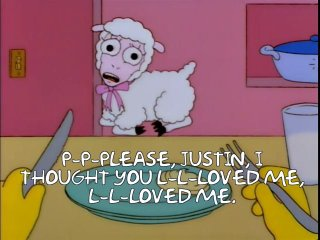
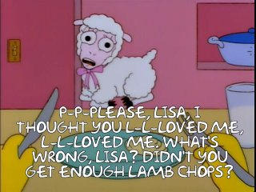

# i-thought-you-llloved-me

This was an experiment to make a very tiny buildpack that did something useful.

# What

There's a scene in the Simpsons episode "Lisa the Vegetarian", where Lisa is
eating a lamb chop, and an imaginary lamb is pleading with her:

This 359-byte¹ app takes that image, and subs out the name "Lisa" with whatever
is used as the URL path.

# Example

1. Given a deployment under the app name `i-thought-you-llloved-me` on Heroku.

2. Append the name you want to insert (e.g., `Justin`) to its URL:

    https://i-thought-you-llloved-me.herokuapp.com/justin

(Case isn't important, since it uses an all-caps font.)

3. Enjoy:

# Frinkiac

¹: The end result is basically a redirector to
[a particular moment on Frinkiac²][frinkiac-original], the comprehensive
Simpsons meme generator.

Technically, the only thing the app does is "parse" an HTTP request and
Base64-encode some text. So, 359 bytes, but it's basically "cheating".

²: Season 7, Episode 5. The moment actually includes two lines of dialog from
Homer, too, but I trimmed it to just the line from the sheep:

[frinkiac-original]: https://frinkiac.com/meme/S07E05/296228.jpg?b64lines=IFAtUC1QTEVBU0UsIExJU0EsIEkKIFRIT1VHSFQgWU9VIEwtTC1MT1ZFRCBNRSwKIEwtTC1MT1ZFRCBNRS4gV0hBVCdTCiBXUk9ORywgTElTQT8gRElETidUIFlPVQogR0VUIEVOT1VHSCBMQU1CIENIT1BTPw==
